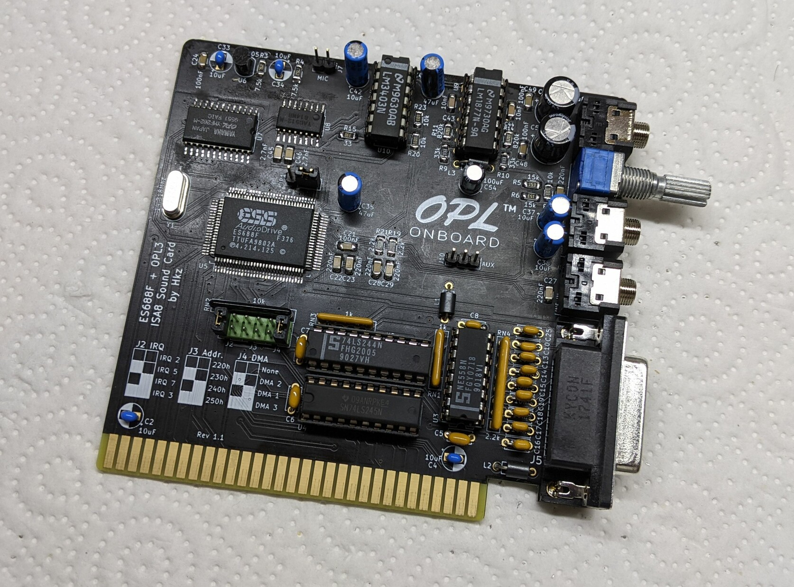

# ES688F / OPL3 8bit ISA Sound Card

## Introduction

This is a sound card for the ISA 8bit bus sporting the **ES688F** chip by *ESS Technology* and the **YMF262** chip by *Yamaha*, also known as the **OPL3**.

This board provides selectable **Sound Blaster PRO** / **Sound Blaster** emulation and **OPL3** compatibility.

It's completely jumper-configurable, requiring no software except the *essvol* utility to set the volume.

This board provides the following connections:

* Speaker out (amplified)
* Line out
* Line in
* Aux in (internal header)
* Microphone in (internal header)
* Joystick port
* MIDI on Joystick port
* Volume regulation pot

### Disclaimer

I take NO responsibility for what happens if you decide to build and use this card. Your computer might crash, catch fire or be destroyed in other nasty ways.
You're encourauged to take what you deem fit from this, and use it in your projects!

### Functionalities

✅ means I tested the functionality and it works, ❌ means I tested the functionality and found issues, ? means that the functionality has yet to be tested.

* [✅] FM Synthesis via OPL3
* [✅] Digital audio playback
* [?] Stereo (left/right channel) check
* [✅] Joystick port
* [✅] Speaker Out (amplified)
* [✅] Line out
* [✅] Line in
* [?] AUX In
* [?] Microphone in
* [✅] MIDI output via Joystick port

The card was tested on:

* [✅] NEC V20 9.5Mhz / DOS 6.22
* [✅] SUNTAC 286 12Mhz motherboard / DOS 6.22

## Configuration

This card is configured via jumpers.

* **JP1**: Selects the **Sound Blaster emulation mode**
  * 1-2: Sound Blaster (DSP v2.11)
  * 2-3 Sound Blaster PRO (DSP v3.1)
  
The following jumpers must me insalled vertically in the block. **1** means **Jumper Present**, **0** means **Jumper Absent**.

* **J2**: Selects the IRQ:
  * 00: IRQ2
  * 10: IRQ5 (default)
  * 01: IRQ7
  * 11: IRQ3
* **J3**: Selects the I/O address:
  * 00: 220h (default)
  * 10: 230h
  * 01: 240h
  * 11: 250h
* **J4**: Selects the DMA channel
  * 00: None
  * 10: DMA2
  * 01: DMA1 (default)
  * 11: DMA3
  
  **WARNING**: /DACK2 and DRQ2 lines are disconnected and must be jumpered on the backside of the board if used, by bridging JP3 and JP2.

## Bill of Materials

**TODO**

## Known Issues

### Rev 1.1

* Missing silkscreen to describe JP1

### Rev 1.0

* Wrong footprints for YAC512 and YMF262 chips
* Volume pot placed after audio decoupling. Wrong.

## Credits

Thanks to [Sergey Kiselev](https://github.com/skiselev) for his symbol/footprint library!

